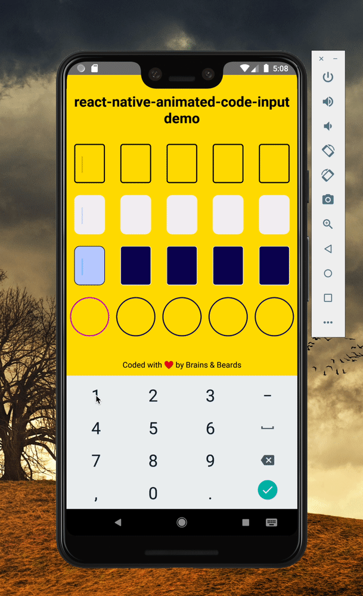
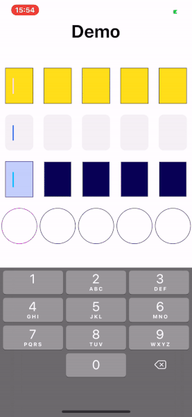

# Animated Code Input

## Description

An animated code input component for React Native. Support for iOS, Android and React Native Web. This is a fully customizable component that allows the developer to write custom styles for the cursor, a single cell, and input focus. The module is also able to handle autofill after receiving a SMS message.

**Support: RN >=0.59.0**

## Demo

|                                                Android                                                |                                              iOS                                              |
| :---------------------------------------------------------------------------------------------------: | :-------------------------------------------------------------------------------------------: |
|  |  |

Automatically fill in SMS passcodes on iOS. On Android the user must tap the Copy button in the notification popup.

|                                                             Android                                                             |                                                         iOS                                                         |
| :-----------------------------------------------------------------------------------------------------------------------------: | :-----------------------------------------------------------------------------------------------------------------: |
|  |  |

## Getting started

### Installation

Install the package with npm.

```bash
npm install react-native-animated-code-input
```

or with yarn

```bash
yarn add react-native-animated-code-input
```

### Run example

```bash
 cd example
 yarn install
 cd ios
 pod install
 cd ..
 yarn react-native run-ios
```

## Simple Example

```js
import React, { FC, useRef, useState, useCallback } from 'react';
import { TextInput, View, StyleSheet } from 'react-native';
import AnimatedNumberInput from 'animated-number-input';

const App: FC = () => {
  const [code, setCode] = useState < string > '';

  const onChangeText = useCallback((text: string) => {
    setCode(text);
  }, []);

  const onSubmit = useCallback((codeValue: string) => {
    Alert.alert(
      'DONE',
      codeValue,
      [{ text: 'OK', onPress: () => setCode('') }],
      { cancelable: false }
    );
  }, []);

  return (
    <>
      <View style={styles.container}>
        <AnimatedNumberInput
          code={code}
          numberOfInputs={5}
          onChangeText={onChangeText}
          onSubmitCode={onSubmit}
        />
      </View>
    </>
  );
};

const styles = StyleSheet.create({
  container: {
    flex: 1,
    justifyContent: 'center',
  },
});
```

## Attributes

Properties for this component:

| Prop                          | Type         | Default       | Description                                                                                                        |
| ----------------------------- | ------------ | ------------- | ------------------------------------------------------------------------------------------------------------------ |
| `cursorAnimationDuration`     | number       | 500           | cursor animation duration                                                                                          |
| `codeAnimationDuration`       | number       | 300           | code animation duration container                                                                                  |
| `code` (**Required**)         | string       | ''            | code string                                                                                                        |
| `index`                       | number       | 0             | active code input                                                                                                  |
| `codeContainerStyle`          | style object | {}            | custom input style                                                                                                 |
| `activeCodeContainerStyle`    | style object | {}            | custom active input style                                                                                          |
| `cursorStyle`                 | style object | {}            | custom cursor style                                                                                                |
| `afterInputDelay`             | number       | 50            | timeout after something is type in an input                                                                        |
| `textColor`                   | string       | black         | input text color                                                                                                   |
| `autoFocus`                   | boolean      | true          | input text color                                                                                                   |
| `numberOfInputs`              | number       | 1             | number of code inputs                                                                                              |
| `textContentType`             | string       | 'oneTimeCode' | give the keyboard and the system information about the expected semantic meaning for the content that users enter. |
| `onBlur`                      | function     | void          | callback that is called when the text input loses focus.                                                           |
| `onChangeText` (**Required**) | function     | void          | callback that is called when the text input's text changes.                                                        |
| `onSubmit` (**Required**)     | function     | void          | callback function called when every code input has a value                                                         |

## Made with 💛 at Brains and Beards

Show some 💛 and star the repo to support the project

[](https://github.com/brains-and-beards/animated-pin-input) [](https://github.com/brains-and-beards/animated-pin-input/fork) [](https://github.com/brains-and-beards/animated-pin-input) [](https://github.com/brains-and-beards/animated-pin-input)  
[](https://twitter.com/brainsandbeards)

## Author & support


[Brains and Beards](https://brainsandbeards.com/)
