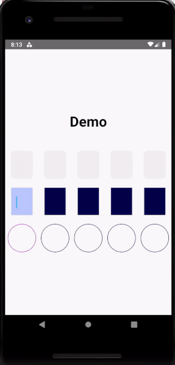
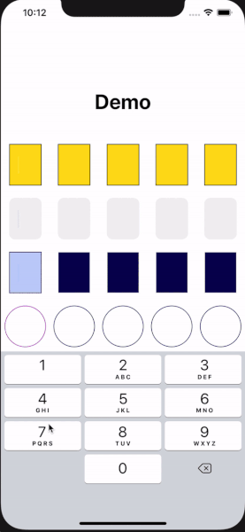

# Animated Number Input

A React Native component for animated code input for iOS, Android and React Native Web.

## Demo

Android: 



iOS:



## Getting started

```
npm install

yarn add
```

Run example:

```
 cd example
 yarn install
 cd ios
 pod install
 cd ..
 react-native run-ios
```

## Example


```js
import React, {FC, useRef, useState, useCallback} from 'react';
import {TextInput, View, StyleSheet} from 'react-native';
import AnimatedNumberInput from 'animated-number-input';

const App: FC = () => {
  const textInputCode = useRef<TextInput>(null);
  const [code, setCode] = useState<string>('');

  const onChangeText = useCallback((text: string) => {
    console.log('code', text);
    setCode(text);
  }, []);

  const onSubmit = useCallback((codeValue: string) => {
    console.log('DONE ', codeValue);
  }, []);

  return (
    <>
      <View style={styles.container}>
        <AnimatedNumberInput
          code={code}
          numberOfInputs={5}
          onChangeText={onChangeText}
          onSubmitCode={onSubmit}
        />
      </View>
    </>
  );
};

const styles = StyleSheet.create({
  container: {
    flex: 1,
    justifyContent: 'center',
  },
});
```

## Attributes

Properties for this component:  

| Prop                          | Type         | Default | Description                                                 |
| ----------------------------- | ------------ | ------- | ----------------------------------------------------------- |
| `cursorAnimationDuration`     | number       | 500     | cursor animation duration                                   |
| `codeAnimationDuration`       | number       | 300     | code animation duration container                           |
| `code` (**Required**)         | string       | ''      | code string                                                 |
| `index`                       | number       | 0       | active code input                                           |
| `codeContainerStyle`          | style object | {}      | custom input style                                          |
| `activeCodeContainerStyle`    | style object | {}      | custom active input style                                   |
| `cursorStyle`                 | style object | {}      | custom cursor style                                         |
| `afterInputDelay`             | number       | 100     | timeout after something is type in an input                 |
| `textColor`                   | string       | black   | input text color                                            |
| `autoFocus`                   | boolean      | true    | input text color                                            |
| `numberOfInputs`              | number       | 1       | number of code inputs                                       |
| `textContentType`             | string       | 'oneTimeCode'  | give the keyboard and the system information about the expected semantic meaning for the content that users enter.  |
| `onBlur`                      | function     | void    | callback that is called when the text input loses focus.    |
| `onChangeText` (**Required**) | function     | void    | callback that is called when the text input's text changes. |
| `onSubmit` (**Required**)     | function     | void    | callback function called when every code input has a value  |
